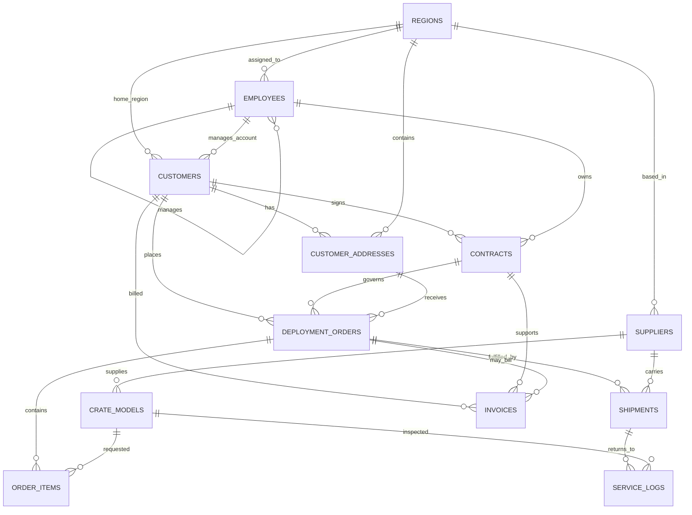

# ReLoop Crate Systems — ER Diagram

```mermaid
erDiagram
  REGIONS ||--o{ EMPLOYEES : assigned_to
  EMPLOYEES ||--o{ EMPLOYEES : manages
  REGIONS ||--o{ CUSTOMERS : home_region
  EMPLOYEES ||--o{ CUSTOMERS : manages_account
  CUSTOMERS ||--o{ CUSTOMER_ADDRESSES : has
  REGIONS ||--o{ CUSTOMER_ADDRESSES : contains
  REGIONS ||--o{ SUPPLIERS : based_in
  SUPPLIERS ||--o{ CRATE_MODELS : supplies
  CUSTOMERS ||--o{ CONTRACTS : signs
  EMPLOYEES ||--o{ CONTRACTS : owns
  CUSTOMERS ||--o{ DEPLOYMENT_ORDERS : places
  CONTRACTS ||--o{ DEPLOYMENT_ORDERS : governs
  CUSTOMER_ADDRESSES ||--o{ DEPLOYMENT_ORDERS : receives
  DEPLOYMENT_ORDERS ||--o{ ORDER_ITEMS : contains
  CRATE_MODELS ||--o{ ORDER_ITEMS : requested
  DEPLOYMENT_ORDERS ||--o{ SHIPMENTS : fulfilled_by
  SUPPLIERS ||--o{ SHIPMENTS : carries
  SHIPMENTS ||--o{ SERVICE_LOGS : returns_to
  CRATE_MODELS ||--o{ SERVICE_LOGS : inspected
  CUSTOMERS ||--o{ INVOICES : billed
  CONTRACTS ||--o{ INVOICES : supports
  DEPLOYMENT_ORDERS ||--o{ INVOICES : may_bill
```
